# Rally — Database Entity-Relationship Diagram

> **Source**: Auto-generated from `backend/app/models/*.py` (SQLAlchemy ORM) and `backend/alembic/versions/` migrations.
> **Database**: PostgreSQL with PostGIS extension (`geography`, `geometry` columns) and Supabase Auth.
> **Last Updated**: 2026-09-29

---

## ERD — Mermaid Diagram

```mermaid
erDiagram

    %% ── External: Supabase Auth ──────────────────────────────────────────
    AUTH_USERS {
        UUID   id   PK
    }

    %% ── Core Identity ────────────────────────────────────────────────────
    PROFILES {
        UUID     id           PK "FK → auth.users.id (CASCADE)"
        VARCHAR  full_name
        TEXT     avatar_url
        TIMESTAMPTZ created_at
        TIMESTAMPTZ updated_at
    }

    %% ── Groups ───────────────────────────────────────────────────────────
    GROUPS {
        UUID     id               PK
        VARCHAR  name
        VARCHAR  join_code        "UNIQUE, indexed"
        UUID     leader_id        FK "→ profiles.id (SET NULL)"
        VARCHAR  destination_name
        GEOGRAPHY destination     "POINT, SRID 4326"
        ENUM     status           "ACTIVE | COMPLETED | ARCHIVED"
        TIMESTAMPTZ created_at
        TIMESTAMPTZ updated_at
    }

    %% ── Group Membership (join table) ────────────────────────────────────
    GROUP_MEMBERS {
        UUID     id         PK
        UUID     group_id   FK "→ groups.id (CASCADE)"
        UUID     user_id    FK "→ profiles.id (CASCADE)"
        ENUM     role       "LEADER | MEMBER"
        ENUM     status     "ACTIVE | LEFT | REMOVED"
        TIMESTAMPTZ joined_at
    }

    %% ── Trips ────────────────────────────────────────────────────────────
    TRIPS {
        UUID     id               PK
        UUID     group_id         FK "→ groups.id (RESTRICT)"
        UUID     started_by       FK "→ profiles.id (SET NULL)"
        ENUM     status           "CREATED | ACTIVE | COMPLETED | CANCELLED"
        TIMESTAMPTZ started_at
        TIMESTAMPTZ ended_at
        VARCHAR  destination_name
        GEOGRAPHY start_location  "POINT, SRID 4326"
        GEOGRAPHY destination     "POINT, SRID 4326"
        FLOAT    distance         "km"
        INTEGER  duration         "minutes"
        INTEGER  safety_score     "0-100"
        TIMESTAMPTZ created_at
        TIMESTAMPTZ updated_at
    }

    %% ── Location History ─────────────────────────────────────────────────
    LOCATION_HISTORY {
        UUID     id           PK
        UUID     trip_id      FK "→ trips.id (CASCADE)"
        UUID     group_id     FK "→ groups.id (CASCADE)"
        UUID     user_id      FK "→ profiles.id (CASCADE)"
        GEOGRAPHY location    "POINT, SRID 4326"
        FLOAT    latitude
        FLOAT    longitude
        FLOAT    accuracy
        FLOAT    speed
        FLOAT    heading
        TIMESTAMPTZ recorded_at
        TIMESTAMPTZ created_at
    }

    %% ── Intelligence Events ──────────────────────────────────────────────
    INTELLIGENCE_EVENTS {
        UUID     id               PK
        UUID     group_id         FK "→ groups.id (CASCADE)"
        UUID     trip_id          FK "→ trips.id (CASCADE)"
        UUID     user_id          FK "→ profiles.id (SET NULL)"
        UUID     related_user_id  FK "→ profiles.id (SET NULL)"
        ENUM     event_type       "FALLING_BEHIND | GROUP_SEPARATION | ..."
        ENUM     severity         "INFO | WARNING | CRITICAL"
        FLOAT    latitude
        FLOAT    longitude
        GEOGRAPHY location        "POINT, SRID 4326, nullable"
        JSONB    event_metadata
        TIMESTAMPTZ detected_at
        TIMESTAMPTZ resolved_at   "NULL = still active"
        TIMESTAMPTZ created_at
    }

    %% ── Alerts ───────────────────────────────────────────────────────────
    ALERTS {
        UUID     id               PK
        UUID     group_id         FK "→ groups.id (CASCADE)"
        UUID     trip_id          FK "→ trips.id (CASCADE)"
        UUID     event_id         FK "→ intelligence_events.id (SET NULL)"
        UUID     user_id          FK "→ profiles.id (SET NULL)"
        UUID     related_user_id  FK "→ profiles.id (SET NULL)"
        ENUM     alert_type       "FALLING_BEHIND | GROUP_SEPARATION | ..."
        ENUM     severity         "INFO | WARNING | CRITICAL"
        ENUM     status           "ACTIVE | ACKNOWLEDGED | RESOLVED"
        TEXT     title
        TEXT     message
        GEOGRAPHY location        "POINT, SRID 4326, nullable"
        JSONB    alert_metadata
        TIMESTAMPTZ created_at
        TIMESTAMPTZ acknowledged_at
        TIMESTAMPTZ resolved_at   "NULL = unresolved"
    }

    %% ── SOS Events ───────────────────────────────────────────────────────
    SOS_EVENTS {
        UUID     id               PK
        UUID     group_id         FK "→ groups.id (CASCADE)"
        UUID     trip_id          FK "→ trips.id (CASCADE)"
        UUID     user_id          FK "→ profiles.id (SET NULL)"
        FLOAT    latitude
        FLOAT    longitude
        FLOAT    accuracy
        GEOGRAPHY location        "POINT, SRID 4326"
        ENUM     status           "ACTIVE | ACKNOWLEDGED | RESOLVED | CANCELLED"
        TEXT     message
        JSONB    sos_metadata
        TIMESTAMPTZ triggered_at
        TIMESTAMPTZ acknowledged_at
        TIMESTAMPTZ resolved_at
        TIMESTAMPTZ created_at
    }

    %% ── Routes ───────────────────────────────────────────────────────────
    ROUTES {
        UUID     id                         PK
        UUID     trip_id                    FK "→ trips.id (CASCADE), UNIQUE"
        VARCHAR  name
        FLOAT    origin_latitude
        FLOAT    origin_longitude
        FLOAT    destination_latitude
        FLOAT    destination_longitude
        GEOMETRY geometry                   "LINESTRING, SRID 4326"
        JSONB    coordinates                "[lon,lat] pairs"
        FLOAT    distance_meters
        INTEGER  estimated_duration_seconds
        ENUM     status                     "PLANNED | ACTIVE | COMPLETED | CANCELLED"
        TIMESTAMPTZ created_at
        TIMESTAMPTZ updated_at
    }

    %% ── Trip Analytics Snapshots ─────────────────────────────────────────
    TRIP_ANALYTICS_SNAPSHOTS {
        UUID     id                        PK
        UUID     trip_id                   FK "→ trips.id (CASCADE), UNIQUE"
        INTEGER  duration_seconds
        FLOAT    distance_traveled_meters
        FLOAT    planned_distance_meters
        FLOAT    completion_percent
        INTEGER  member_count
        INTEGER  alerts_count
        INTEGER  critical_alerts_count
        INTEGER  sos_count
        INTEGER  route_deviations
        TIMESTAMPTZ generated_at
    }

    %% ── Notifications ────────────────────────────────────────────────────
    NOTIFICATIONS {
        UUID     id                    PK
        UUID     user_id               FK "→ profiles.id (CASCADE)"
        UUID     trip_id               FK "→ trips.id (CASCADE), nullable"
        VARCHAR  type                  "e.g. TRIP_STARTED, ALERT_FIRED"
        TEXT     title
        TEXT     message
        VARCHAR  severity              "INFO | WARNING | CRITICAL (display)"
        VARCHAR  dedup_key             "nullable; partial UNIQUE per user"
        JSONB    notification_metadata
        TIMESTAMPTZ read_at
        TIMESTAMPTZ created_at
    }


    %% ════════════════════════════════════════════════════════════════
    %% Relationships
    %% ════════════════════════════════════════════════════════════════

    AUTH_USERS         ||--|| PROFILES                  : "identity (1-to-1)"

    PROFILES           ||--o{ GROUPS                   : "leads"
    PROFILES           ||--o{ GROUP_MEMBERS            : "joins as member"
    PROFILES           ||--o{ TRIPS                    : "starts"
    PROFILES           ||--o{ LOCATION_HISTORY         : "tracked in"
    PROFILES           ||--o{ INTELLIGENCE_EVENTS      : "subject of"
    PROFILES           ||--o{ ALERTS                   : "subject of"
    PROFILES           ||--o{ SOS_EVENTS               : "triggers"
    PROFILES           ||--o{ NOTIFICATIONS            : "receives"

    GROUPS             ||--o{ GROUP_MEMBERS            : "has members"
    GROUPS             ||--o{ TRIPS                    : "has trips"
    GROUPS             ||--o{ LOCATION_HISTORY         : "tracks in"
    GROUPS             ||--o{ INTELLIGENCE_EVENTS      : "owns events"
    GROUPS             ||--o{ ALERTS                   : "owns alerts"
    GROUPS             ||--o{ SOS_EVENTS               : "owns SOS"

    TRIPS              ||--o{ LOCATION_HISTORY         : "records GPS in"
    TRIPS              ||--o{ INTELLIGENCE_EVENTS      : "generates"
    TRIPS              ||--o{ ALERTS                   : "generates"
    TRIPS              ||--o{ SOS_EVENTS               : "generates"
    TRIPS              ||--o| ROUTES                   : "planned via (0 or 1)"
    TRIPS              ||--o| TRIP_ANALYTICS_SNAPSHOTS : "summarized by (0 or 1)"
    TRIPS              ||--o{ NOTIFICATIONS            : "sources"

    INTELLIGENCE_EVENTS ||--o| ALERTS                  : "escalated to"
```

> **Cardinality key**: `||--||` = exactly one to one · `||--o{` = one to many · `||--o|` = one to zero-or-one

---

## Data Dictionary

| Entity | Table Name | Purpose | Key Columns | Delete Behaviour |
|---|---|---|---|---|
| **AUTH_USERS** | `auth.users` | External Supabase Auth identity store — **not owned by this app**. Serves only as the FK target for `profiles.id`. | `id` (UUID PK) | Managed by Supabase; `CASCADE` propagates to `profiles` |
| **Profile** | `profiles` | Application-level user record, one-to-one with `auth.users`. Stores display name and avatar. `id` is not auto-generated — it must match the Supabase auth UID. | `id` (PK=FK), `full_name`, `avatar_url` | Cascades from `auth.users`; SET NULL on group leader / trip starter references |
| **Group** | `groups` | A named rally group with a unique invite code and optional geospatial destination. One group can have multiple trips over its lifetime. | `id`, `join_code` (UNIQUE), `leader_id` (FK→profiles, SET NULL), `destination` (GEOGRAPHY) | Must not be deleted while active trips exist (`RESTRICT` on `trips.group_id`) |
| **GroupMember** | `group_members` | Join table linking users to groups with roles and lifecycle status. Enforces a composite unique constraint `(group_id, user_id)`. | `group_id`, `user_id`, `role` (LEADER / MEMBER), `status` (ACTIVE / LEFT / REMOVED) | Cascade-deleted when the group or user profile is removed |
| **Trip** | `trips` | A single active journey belonging to a group. Captures lifecycle timestamps, optional planned route metrics, and a safety score. A partial unique index enforces **at most one ACTIVE trip per group** at the DB level. | `group_id`, `started_by`, `status`, `started_at`, `ended_at`, `safety_score` | RESTRICT on `groups.id`; CASCADE to all child tables |
| **LocationHistory** | `location_history` | Append-only GPS breadcrumb log. Captures raw latitude/longitude plus the PostGIS `GEOGRAPHY(POINT)` column. Also redundantly stores `group_id` alongside `trip_id` for efficient group-scoped queries without a join. | `trip_id`, `group_id`, `user_id`, `location`, `latitude`, `longitude`, `recorded_at` | CASCADE from trip, group, or user |
| **IntelligenceEvent** | `intelligence_events` | Raw signal from the intelligence engine (detections only, not user-facing). `resolved_at IS NULL` = currently active. A partial unique index on `(trip_id, event_type, user_id) WHERE resolved_at IS NULL` prevents duplicate active detections. | `event_type`, `severity`, `user_id` (nullable for group-level), `event_metadata` (JSONB), `detected_at`, `resolved_at` | CASCADE from trip/group; SET NULL on user refs |
| **Alert** | `alerts` | User-facing notification created by the alert engine from an `IntelligenceEvent`. A partial unique index on `event_id WHERE resolved_at IS NULL` prevents alert spam for one ongoing condition. | `event_id` (FK SET NULL), `alert_type`, `severity`, `status`, `title`, `message`, `alert_metadata` (JSONB), `acknowledged_at`, `resolved_at` | CASCADE from trip/group; SET NULL on user/event refs |
| **SOSEvent** | `sos_events` | User-triggered emergency record. The trigger location is captured once and never overwritten. Distinct from the alert system — SOS events are never generated by the intelligence engine. | `user_id` (SET NULL to preserve record), `latitude`, `longitude`, `location` (GEOGRAPHY), `status`, `sos_metadata` (JSONB), `triggered_at` | CASCADE from trip/group; SET NULL on user (emergency record is preserved after user deletion) |
| **Route** | `routes` | The planned path for a trip, stored as both a PostGIS `GEOMETRY(LINESTRING)` and a JSONB `coordinates` array. One route per trip (`trip_id` UNIQUE). GPS updates never modify this table. | `trip_id` (FK, UNIQUE), `geometry` (LINESTRING), `coordinates` (JSONB), `distance_meters`, `estimated_duration_seconds`, `status` | CASCADE from trip |
| **TripAnalyticsSnapshot** | `trip_analytics_snapshots` | Frozen summary of a completed trip's headline metrics, generated once on trip-end. `trip_id` is UNIQUE to prevent duplicate snapshot rows from race conditions. | `trip_id` (FK, UNIQUE), `duration_seconds`, `distance_traveled_meters`, `completion_percent`, `member_count`, `alerts_count`, `sos_count`, `route_deviations`, `generated_at` | CASCADE from trip |
| **Notification** | `notifications` | Per-user in-app notification record. `dedup_key` + a partial unique index prevent repeated notifications for a still-active source condition. `trip_id` is nullable for future non-trip notifications. | `user_id`, `trip_id` (nullable), `type`, `severity`, `dedup_key` (nullable, partial UNIQUE per user), `notification_metadata` (JSONB), `read_at` | CASCADE from user/trip |

---

## Enum Reference

| Enum Name | Values | Used By |
|---|---|---|
| `GroupStatus` | `ACTIVE`, `COMPLETED`, `ARCHIVED` | `groups.status` |
| `MemberRole` | `LEADER`, `MEMBER` | `group_members.role` |
| `MemberStatus` | `ACTIVE`, `LEFT`, `REMOVED` | `group_members.status` |
| `TripStatus` | `CREATED`, `ACTIVE`, `COMPLETED`, `CANCELLED` | `trips.status` |
| `AlertType` | `FALLING_BEHIND`, `GROUP_SEPARATION`, `ISOLATED_MEMBER`, `UNEXPECTED_STOP`, `SPEED_ANOMALY`, `ROUTE_DEVIATION` | `alerts.alert_type` |
| `AlertSeverity` | `INFO`, `WARNING`, `CRITICAL` | `alerts.severity` |
| `AlertStatus` | `ACTIVE`, `ACKNOWLEDGED`, `RESOLVED` | `alerts.status` |
| `SOSStatus` | `ACTIVE`, `ACKNOWLEDGED`, `RESOLVED`, `CANCELLED` | `sos_events.status` |
| `IntelligenceEventType` | `FALLING_BEHIND`, `GROUP_SEPARATION`, `UNEXPECTED_STOP`, `SPEED_ANOMALY`, `ISOLATED_MEMBER`, `MOVING_TOGETHER`, `STOPPED`, `MOVING`, `ROUTE_DEVIATION` | `intelligence_events.event_type` |
| `IntelligenceSeverity` | `INFO`, `WARNING`, `CRITICAL` | `intelligence_events.severity` |
| `RouteStatus` | `PLANNED`, `ACTIVE`, `COMPLETED`, `CANCELLED` | `routes.status` |

---

## Key Architectural Patterns

> [!NOTE]
> **Partial Unique Indexes** are used throughout to enforce business constraints at the database level:
> - `uq_trips_one_active_per_group` — at most one `ACTIVE` trip per group
> - `uq_intelligence_events_one_active_per_subject` — at most one active detection per `(trip, event_type, user)`
> - `uq_alerts_one_unresolved_per_event` — at most one unresolved alert per intelligence event
> - `uq_notifications_user_dedup_key` — at most one notification per `(user, dedup_key)` (non-null)

> [!IMPORTANT]
> **Two Delete Strategies for Child Records**:
> - `CASCADE` — used for operational data that has no meaning without its parent (location breadcrumbs, group members)
> - `SET NULL` + preserved row — used for audit/legal records that must outlive their human subjects (SOS events after user deletion, alerts after intelligence event cleanup)

> [!TIP]
> **`groups.id` on `trips`** uses `RESTRICT` (not `CASCADE`) — a group cannot be deleted while it still has trip history. This is intentional to prevent accidental destruction of historical records.
